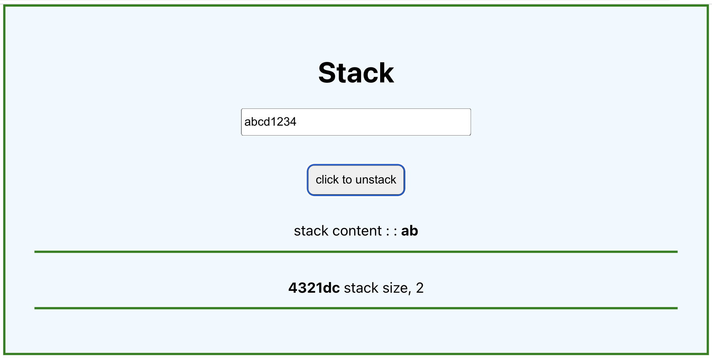

# Getting Started with Create React App

# Whats a Stack
A stack is a data structure that follows Last In Fast Out (LIFO) or 'Fisrt In, Last Out' principle. 

### Implimention in the app

a user enters a string, the string is converted to array then the last letter to be keyed in is removed from stack every time the button is clicked

### Technologies

- React,
- JavaScript,
- HTML
- CSS

### Screenshort

